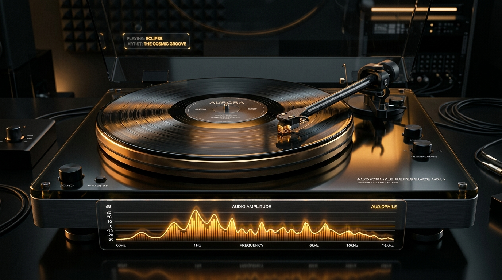
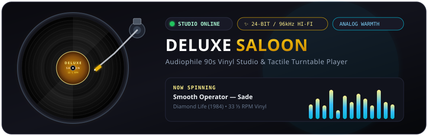
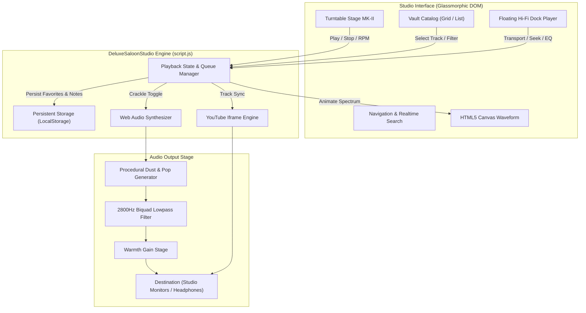

<div align="center">

# 📻 DELUXE SALOON
### *Hi-Fi 90s Vinyl Studio & Audiophile Archive*

<p align="center">
  
</p>

<!-- Live Animated Turntable Deck & Studio Equalizer -->
<p align="center">
  
</p>

<!-- Technology Badges & Live Status -->
<p align="center">
  <a href="https://developer.mozilla.org/en-US/docs/Web/HTML"></a>
  <a href="https://developer.mozilla.org/en-US/docs/Web/CSS"></a>
  <a href="https://developer.mozilla.org/en-US/docs/Web/JavaScript"></a>
  <a href="https://getbootstrap.com/"></a>
  <a href="https://developer.mozilla.org/en-US/docs/Web/API/Web_Audio_API"></a>
  <a href="https://developers.google.com/youtube/iframe_api_reference"></a>
  <a href="LICENSE"></a>
</p>

<p align="center">
  <strong>Immersive, analog-warm vinyl listening experience built for the modern web.</strong><br>
  Featuring tactile mechanical tonearm dynamics, 33 ⅓ & 45 RPM platter controls, real-time procedural crackle synthesis, dynamic audio spectrum analysis, and seamless synced YouTube streaming.
</p>

<p align="center">
  <a href="#-key-features">Key Features</a> •
  <a href="#-interactive-studio-deck">Turntable Deck</a> •
  <a href="#-universal-dock-player">Hi-Fi Dock</a> •
  <a href="#-curated-vinyl-vault">Vinyl Vault</a> •
  <a href="#%EF%B8%8F-keyboard-shortcuts">Shortcuts</a> •
  <a href="#-quick-start">Quick Start</a> •
  <a href="#-architecture">Architecture</a>
</p>

<p align="center">
  
</p>

</div>

---

## 🌟 Overview

**Deluxe Saloon** reimagines the tactile romance of physical vinyl record culture in an ultra-modern digital studio interface. Designed around deep midnight tones, brushed metallic hardware, warm analog gold accents, and fluid glassmorphism, it bridges 90s nostalgia with cutting-edge browser audio capabilities.

Listen to iconic tracks from **Sade**, **Massive Attack**, **The Prodigy**, **Radiohead**, and **Oasis**, complete with authentic physical tonearm kinematics, dual rotational speeds, procedural vinyl surface noise, and customizable 3-band analog equalization.

---

## ⚡ Key Features

<table>
  <tr>
    <td width="50%" valign="top">
      <h3>🎛️ Studio MK-II Turntable Deck</h3>
      <ul>
        <li><strong>Kinematic Tonearm Tracking</strong>: Mechanical tonearm assembly with counterweight and gold cartridge needle automatically rotates onto the vinyl during playback and returns to rest on stop.</li>
        <li><strong>Dual Platter Velocities</strong>: Seamless toggle between <strong>33 ⅓ RPM</strong> LPs and <strong>45 RPM</strong> singles with realistic angular acceleration.</li>
        <li><strong>Procedural Vinyl Crackle (Web Audio API)</strong>: Real-time mathematical synthesis generating authentic surface friction, dust clicks, and pops filtered through a 2800Hz analog biquad stage.</li>
        <li><strong>HTML5 Canvas Waveform Analyzer</strong>: 32-band real-time audio visualizer displaying gold-to-cyan gradient frequency amplitudes.</li>
      </ul>
    </td>
    <td width="50%" valign="top">
      <h3>🎧 Universal Hi-Fi Floating Dock</h3>
      <ul>
        <li><strong>Persistent Transport Controls</strong>: Floating glassmorphic dock with Play/Pause, Skip Next/Prev, Shuffle, and Repeat modes.</li>
        <li><strong>Synced YouTube Video Stream</strong>: Slide-out drawer housing an embedded player perfectly synchronized with audio timecodes.</li>
        <li><strong>3-Band Audiophile Equalizer</strong>: Granular control over Bass (100Hz), Mid (1kHz), and Treble (10kHz) with instant audio presets (<em>Warm Vinyl</em>, <em>Rock</em>, <em>Pop</em>, <em>Jazz</em>, <em>Flat</em>).</li>
        <li><strong>Sleep Timer & Up-Next Queue</strong>: Auto-shutdown timer (15–60m or custom) and a draggable playback queue drawer.</li>
      </ul>
    </td>
  </tr>
  <tr>
    <td width="50%" valign="top">
      <h3>📚 Curated Vinyl Vault</h3>
      <ul>
        <li><strong>Dynamic View Modes</strong>: One-click switching between a high-impact <strong>Grid Card View</strong> and a streamlined <strong>Studio List View</strong>.</li>
        <li><strong>Multi-Genre Filtering</strong>: Instant filtering across <em>Jazz & Soul</em>, <em>Rock</em>, <em>Electronic</em>, <em>Synthwave</em>, and <em>Hip Hop</em>.</li>
        <li><strong>Instant Search (⌘K / Ctrl+K)</strong>: Rapid full-text search indexing title, artist, album, and release year.</li>
        <li><strong>Sort Matrix</strong>: Order by popularity, alphabetical title, artist, or vintage release year.</li>
      </ul>
    </td>
    <td width="50%" valign="top">
      <h3>💬 Liner Notes & Community Memory</h3>
      <ul>
        <li><strong>Persistent Liner Notes</strong>: Modal discussion forum per track allowing users to contribute memories and impressions saved to <code>localStorage</code>.</li>
        <li><strong>Favorites & History Collection</strong>: Bookmark beloved vinyl cuts and inspect your listening trajectory across sessions.</li>
        <li><strong>Simulated Live Listeners</strong>: Live status beacon displaying fluctuating studio listeners around the world.</li>
      </ul>
    </td>
  </tr>
</table>

---

## 🎛️ Interactive Studio Deck

The centerpiece of Deluxe Saloon is the virtual **Technics-inspired MK-II Turntable Stage**:

```
+-----------------------------------------------------------+
|  [●] POWER   STUDIO MK-II               [ 33 RPM | 45 RPM ]|
|                                                           |
|       .-----------------.        (Pivot / Counterweight)  |
|      /     _..._         \                  \\            |
|     |    .'     '.        |                  \\ (Tonearm) |
|     |   /  ( O )  \       |                   \\          |
|     |   '.       .'       |                    [====>     |
|      \    `''-''`        /                    (Stylus)    |
|       '-----------------'                                 |
|                                                           |
|  [||||||||||||||||||||||||||||||||]  Visualizer Canvas    |
|                                                           |
|  24-BIT / 96kHz VINYL MASTER • 90s Lounge                 |
|  Smooth Operator — Sade                                   |
|                                                           |
|  [🔀]   [⏮]   [ ▶ / ⏸ ]   [⏭]   [❤️]                      |
|                                                           |
|  [📻 Analog Vinyl Crackle: ON / OFF]                      |
+-----------------------------------------------------------+
```

---

## ⌨️ Keyboard Shortcuts

Control your playback without leaving the keyboard:

<div align="center">

| Key | Action | Function |
| :---: | :--- | :--- |
| <kbd>Space</kbd> | **Play / Pause** | Toggle turntable rotation and audio playback |
| <kbd>→</kbd> | **Seek +10s** | Skip ahead 10 seconds |
| <kbd>←</kbd> | **Seek -10s** | Rewind 10 seconds |
| <kbd>↑</kbd> | **Volume Up** | Increase master output by 5% |
| <kbd>↓</kbd> | **Volume Down** | Decrease master output by 5% |
| <kbd>M</kbd> | **Mute / Unmute** | Toggle studio mute status |
| <kbd>/</kbd> or <kbd>Ctrl</kbd> + <kbd>K</kbd> | **Search** | Instantly focus the global catalog search bar |

</div>

---

## 💿 Curated Release Archive

Every cut in the master catalog is curated for vintage fidelity and distinct genre definition:

| Vinyl Cut | Title | Artist | Album | Genre | Year | Fidelity Master |
| :---: |:---|:---|:---|:---:|:---:|:---|
| `01` | **Smooth Operator** | Sade | *Diamond Life* | Jazz & Soul | 1984 | 24-BIT / 96kHz Vinyl Master |
| `02` | **Breathe** | The Prodigy | *The Fat of the Land* | Electronic | 1996 | Original 12" 45 RPM Cut |
| `03` | **Creep** | Radiohead | *Pablo Honey* | Rock | 1993 | Analog Tape Re-Issue |
| `04` | **Wonderwall** | Oasis | *(What's the Story) Morning Glory?* | Rock | 1995 | Abbey Road Remaster |
| `05` | **California Love** | 2Pac ft. Dr. Dre | *All Eyez on Me* | Hip Hop | 1995 | West Coast 12" Single Cut |
| `06` | **Teardrop** | Massive Attack | *Mezzanine* | Electronic | 1998 | Heavyweight 180g Pressing |
| `07` | **Midnight City** | M83 | *Hurry Up, We're Dreaming* | Synthwave | 2011 | Synthwave Audiophile Edition |
| `08` | **Fly Me to the Moon** | Frank Sinatra | *It Might as Well Be Swing* | Jazz & Soul | 1964 | Reprise Mono Acetate |
| `09` | **Black Hole Sun** | Soundgarden | *Superunknown* | Rock | 1994 | Seattle Grunge Master |
| `10` | **Autumn Leaves** | Bill Evans Trio | *Portrait in Jazz* | Jazz & Soul | 1960 | Riverside Vinyl Transfer |
| `11` | **No Diggity** | Blackstreet | *Another Level* | Hip Hop | 1996 | 90s Gold Certified Master |
| `12` | **Nightcall** | Kavinsky | *OutRun* | Synthwave | 2010 | Analog Electro 12" Cut |

---

## 🏗️ Architecture



---

## 🚀 Quick Start

Deluxe Saloon is built with **zero external dependencies or build pipelines**. Simply launch and listen.

### Option 1: Double Click
Open [`index.html`](index.html) directly in any modern web browser (Chrome, Edge, Firefox, Safari).

### Option 2: VS Code Live Server (Recommended)
1. Open the project folder in **Visual Studio Code**.
2. Install the **Live Server** extension (`ritwickdey.liveserver`).
3. Right-click on [`index.html`](index.html) and select **Open with Live Server**.

### Option 3: Local Command-Line Server

```bash
# Using Python 3
python -m http.server 8080

# Using Node.js npx
npx serve .

# Using PHP
php -S localhost:8080
```
Open [http://localhost:8080](http://localhost:8080) in your browser.

---

## 📁 Repository Structure

```text
Music Store/
├── assets/
│   ├── banner.jpg                  # High-resolution audiophile turntable studio banner
│   ├── vinyl-deck-animation.svg    # Animated SVG spinning turntable & live equalizer
│   └── equalizer-waves.svg         # Animated audio spectrum divider
├── hero-banner.jpg                 # Original studio artistic asset
├── index.html                      # Semantic studio layout, modal & dock markup
├── style.css                       # Complete design tokens, glassmorphism & turntable CSS
├── script.js                       # DeluxeSaloonStudio ES6 class, Web Audio API & YouTube API
└── README.md                       # Comprehensive documentation & visual guide
```

---

## 🎨 Design Tokens & Aesthetic Principles

- **Primary Canvas**: `#090a0f` — Deep studio onyx backdrop.
- **Glassmorphic Paneling**: `rgba(18, 20, 32, 0.72)` with `backdrop-filter: blur(20px)`.
- **Vintage Gold Accent**: `#d4af37` / `#fef08a` — Simulating physical brass indicators and warm tonearm cart reflections.
- **Cyan Hi-Fi Highlights**: `#06b6d4` / `#38bdf8` — Highlighting frequency analysis and modern studio readouts.
- **Typography**: [Outfit](https://fonts.google.com/specimen/Outfit) (Geometric Headers), [Plus Jakarta Sans](https://fonts.google.com/specimen/Plus+Jakarta+Sans) (Body & Meta), [JetBrains Mono](https://fonts.google.com/specimen/JetBrains+Mono) (Studio Indicators & Timecodes).

---

## 🤝 Contributing

Contributions, track suggestions, and sound design enhancements are welcome!
1. Fork the Project (`https://github.com/bangalsubham20/Music-Store`)
2. Create your Feature Branch (`git checkout -b feature/AnalogWarmth`)
3. Commit your Changes (`git commit -m 'Add new analog tube saturation filter'`)
4. Push to the Branch (`git push origin feature/AnalogWarmth`)
5. Open a Pull Request

---

## 📜 License

Distributed under the **MIT License**. See `LICENSE` for more information.

<div align="center">
  <p>Crafted with analog warmth, vinyl passion &amp; modern web standards.</p>
  
</div>
