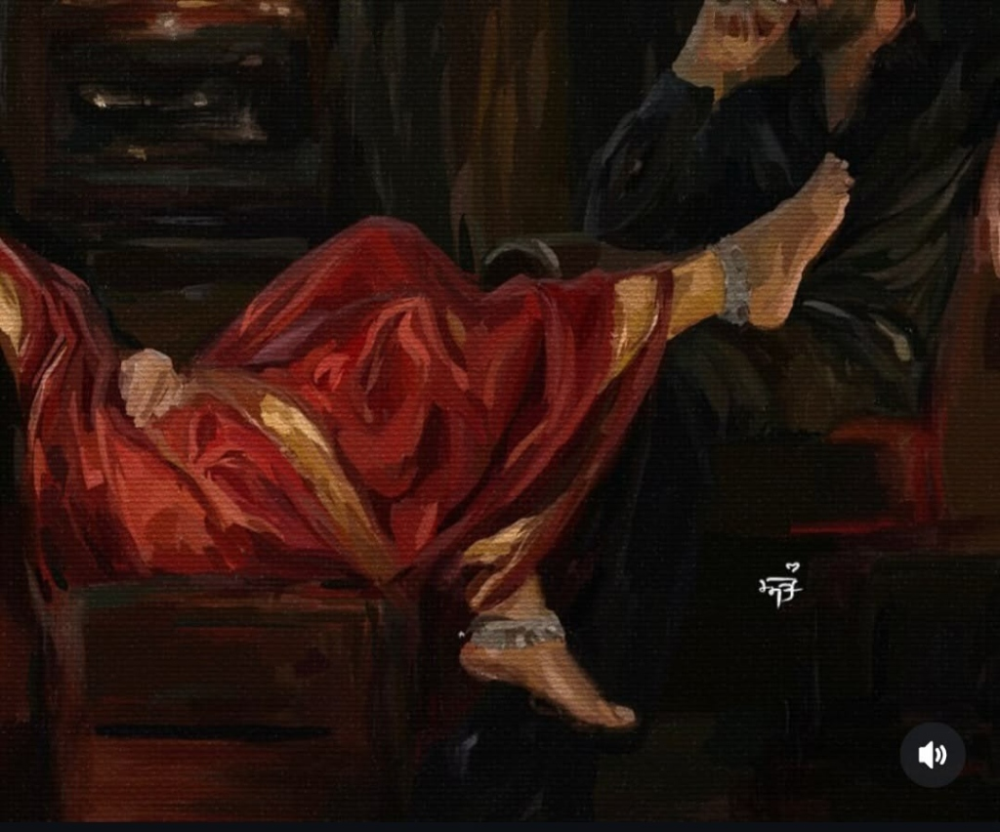

# 🎵 Deluxe Saloon — Hi-Fi 90s Vinyl & Music Studio



[](https://developer.mozilla.org/en-US/docs/Web/HTML)
[](https://developer.mozilla.org/en-US/docs/Web/CSS)
[](https://developer.mozilla.org/en-US/docs/Web/JavaScript)
[](https://getbootstrap.com/)
[](https://developer.mozilla.org/en-US/docs/Web/API/Web_Audio_API)
[](LICENSE)

> A minimalist, audiophile-grade web music studio and vinyl archive inspired by 90s analog warmth, tactile turntable mechanics, and modern dark glassmorphism.

---

## ✨ Features

### 🎛️ Studio MK-II Vinyl Turntable Deck
- **Interactive Platter & Disc**: Realistic spinning vinyl record with micro-grooves, dynamic light reflections, and center album labels.
- **Physical Tonearm Tracking**: Mechanical tonearm assembly rotates into place when tracks play and returns to rest upon pausing.
- **Dual Speed Selection**: Toggle between standard **33 ⅓ RPM** albums and **45 RPM** singles with corresponding platter spin velocity changes.
- **Synthesized Vinyl Crackle (Web Audio API)**: Built-in procedural analog surface noise generator featuring pop/dust emulation, a 2800Hz low-pass biquad filter, and adjustable warmth gain.
- **Real-Time Waveform Visualizer**: Smooth HTML5 Canvas spectrum analyzer with gold-to-cyan gradient frequency bars responding to playback.

### 🎧 Universal Hi-Fi Dock Player
- **Floating Glassmorphic Dock**: Persistent bottom player with full transport controls (Play/Pause, Next, Previous, Shuffle, and Repeat).
- **Time Scrubbing & Seeking**: Accurate progress tracking with interactive seekbar and remaining duration counters.
- **Volume & Mute Controls**: Granular master volume slider with quick mute toggling.
- **Synced Video Stream Drawer**: Integrated YouTube iframe player for watching original music videos synced with your queue.
- **3-Band Equalizer**: Custom adjustments for **Bass (100Hz)**, **Mid (1kHz)**, and **Treble (10kHz)** with one-click presets (*Flat*, *Warm Vinyl*, *Rock*, *Pop*, *Jazz*).
- **Sleep Timer**: Auto-shutoff options (15, 30, 45, 60 minutes or custom duration).
- **Dynamic Playback Queue**: Drawer to inspect and manage upcoming tracks.

### 📚 Curated Vault & Library
- **Dual Layout Modes**: Switch smoothly between **Grid View** (album art covers) and **List View** (compact studio table).
- **Multi-Genre Filter**: Quickly filter by *All*, *Pop*, *Rock*, *Jazz & Soul*, *Electronic*, *Synthwave*, and *Hip Hop*.
- **Sorting Options**: Sort by Default, Most Played, Track Title (A–Z), Artist (A–Z), or Release Year.
- **Instant Search**: Real-time filtering across titles, artists, and genres with `⌘K` / `Ctrl+K` keyboard quick-launch.
- **Track Liner Notes (Comments)**: Community memory box allowing listeners to read and post vinyl impressions stored in `localStorage`.
- **Favorites & History Tabs**: Bookmark beloved tracks and review recently played records across sessions.

---

## ⌨️ Keyboard Shortcuts

| Shortcut | Action |
| :--- | :--- |
| <kbd>Space</kbd> | Toggle Play / Pause |
| <kbd>→</kbd> *(Right Arrow)* | Seek forward 10 seconds |
| <kbd>←</kbd> *(Left Arrow)* | Seek backward 10 seconds |
| <kbd>↑</kbd> *(Up Arrow)* | Increase volume (+5%) |
| <kbd>↓</kbd> *(Down Arrow)* | Decrease volume (-5%) |
| <kbd>M</kbd> | Mute / Unmute audio |
| <kbd>/</kbd> or <kbd>Ctrl</kbd>+<kbd>K</kbd> / <kbd>⌘</kbd>+<kbd>K</kbd> | Focus search bar |

---

## 📁 Project Structure

```text
Music Store/
├── index.html         # Main semantic HTML5 markup with turntable & dock structure
├── style.css          # Design system, glassmorphism tokens, and turntable animations
├── script.js          # Core application logic, Web Audio synthesis, and YouTube API
├── hero-banner.jpg    # Cover banner asset for documentation and previews
└── README.md          # Project documentation and setup instructions
```

---

## 🚀 Getting Started

No build step or package installations required! The application runs purely on vanilla HTML, CSS, and modern JavaScript.

### Method 1: Open Directly in Browser
Simply double-click [`index.html`](file:///c:/Users/SUBHAM/OneDrive/Desktop/Project/Music%20Store/index.html) or open it with your favorite modern browser (Google Chrome, Firefox, Safari, Edge).

### Method 2: Local Development Server (Recommended)

Using **VS Code Live Server**:
1. Open the project folder in Visual Studio Code.
2. Right-click on [`index.html`](file:///c:/Users/SUBHAM/OneDrive/Desktop/Project/Music%20Store/index.html) and select **"Open with Live Server"**.

Using **Python**:
```bash
# Python 3
python -m http.server 8080
```
Then visit `http://localhost:8080` in your web browser.

Using **Node.js (`npx serve`)**:
```bash
npx serve .
```

---

## 💿 Curated Tracklist

| # | Track | Artist | Album | Genre | Year |
|---|:---|:---|:---|:---|:---:|
| 01 | **Smooth Operator** | Sade | *Diamond Life* | Jazz & Soul | 1984 |
| 02 | **Breathe** | The Prodigy | *The Fat of the Land* | Electronic | 1996 |
| 03 | **Creep** | Radiohead | *Pablo Honey* | Rock | 1993 |
| 04 | **Wonderwall** | Oasis | *(What's the Story) Morning Glory?* | Rock | 1995 |
| 05 | **California Love** | 2Pac ft. Dr. Dre | *All Eyez on Me* | Hip Hop | 1995 |
| 06 | **Teardrop** | Massive Attack | *Mezzanine* | Electronic | 1998 |
| 07 | **Midnight City** | M83 | *Hurry Up, We're Dreaming* | Synthwave | 2011 |
| 08 | **Fly Me to the Moon** | Frank Sinatra | *It Might as Well Be Swing* | Jazz & Soul | 1964 |
| 09 | **Black Hole Sun** | Soundgarden | *Superunknown* | Rock | 1994 |
| 10 | **Autumn Leaves** | Bill Evans Trio | *Portrait in Jazz* | Jazz & Soul | 1960 |
| 11 | **No Diggity** | Blackstreet | *Another Level* | Hip Hop | 1996 |
| 12 | **Nightcall** | Kavinsky | *OutRun* | Synthwave | 2010 |

---

## 🛠️ Built With

- **HTML5 & CSS3**: Custom design tokens, CSS variables, glassmorphic backdrop filters, and turntable physics animations.
- **JavaScript (ES6+)**: Object-oriented class architecture (`DeluxeSaloonStudio`), event handling, and data binding.
- **Bootstrap 5**: Grid layout, responsive utilities, and modal dialogues.
- **Font Awesome 6**: Vector icons for audio transport, turntable knobs, and utilities.
- **Google Fonts**: [Outfit](https://fonts.google.com/specimen/Outfit), [Plus Jakarta Sans](https://fonts.google.com/specimen/Plus+Jakarta+Sans), and [JetBrains Mono](https://fonts.google.com/specimen/JetBrains+Mono).
- **Web Audio API**: Real-time noise generation buffer for authentic analog vinyl crackle.
- **YouTube Iframe API**: Streamed audio/video synchronization for track playback.

---

## 📄 License

This project is open-source and available under the [MIT License](LICENSE).
